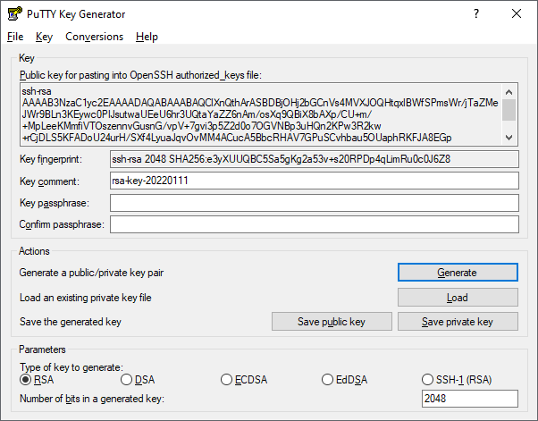
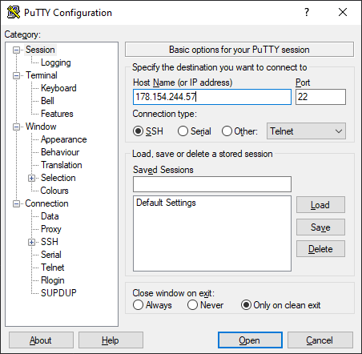
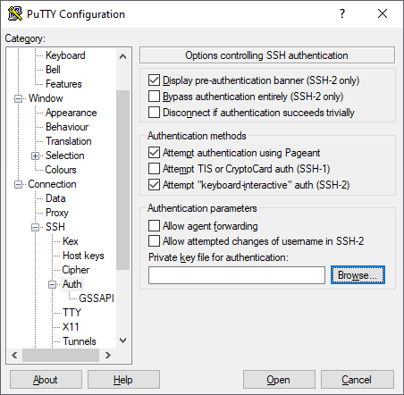
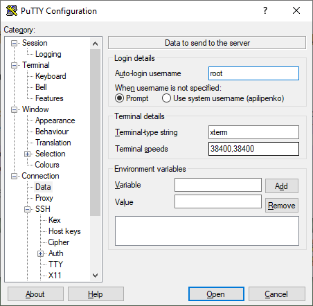
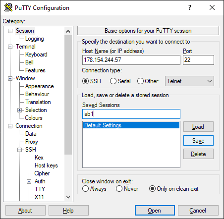

# Генерация ключей
## Windows
1. Скачать и установить [PuTTY + PuTTYgen](https://putty.org.ru/download.html)
2. Запустить PuTTYgen 
   
   

3. Нажать `Generate` и подвигать мышкой до окончания процесса генерации
4. Сохранить закрытую часть ключа (`Save private key`)

   

   1. При желании можно дополнительно указать пароль. 
   Он будет запрашиваться при каждом подключении
   2. Сохранить открытую часть ключа
      1. **Важно** необходимо сохранить содержимое текстового поля, а не результат нажатия кнопки (`Save public key`)
   3. Сохраненную открытую часть ключа необходимо использовать при создании Dataproc кластера или ВМ

## Подключение к ВМ
1. Запустить PuTTY

   

2. В поле `Host Name (or IP address)` вставить публичный адрес ВМ
3. В разделе `Connection` -> `SSH` -> `Auth` в поле `Private key for authentication` выбрать закрытую часть ключа

   

4. Если используется нестандартное имя пользователя на ВМ - в разделе `Connection` -> `Data` необходимо его вписать в поле `Auto login username`
   (в нашем случае с Dataproc для версии 1.4 используется `root`, для версии 2.0 используется `ubuntu`)
   
   

5. Сохранить настройки можно в разделе `Session`
   1. В поле `Saved sessions` написать название профиля (`lab 1`)
   2. Нажать `Save` - профиль появится в списке
       
   

6. Нажать `Open` - будет произведено подключение.
   1. Если при подключении будет ошибка авторизации ключа и запрос пароля - значить что-то сделано не так при создании ВМ (кластера)
      * обычно ошибка связна с некорректно введенным открытым ключом при создании ВМ
