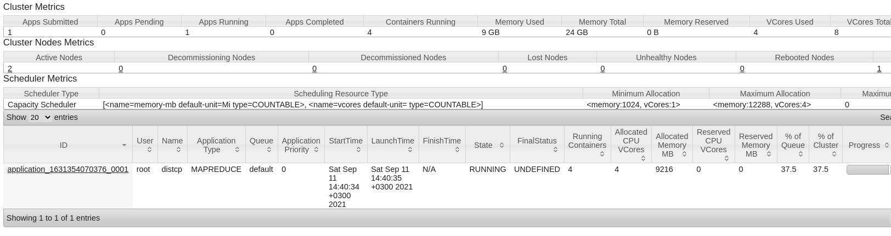
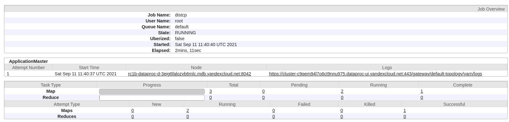

## Подключение к hadoop

* Копируем публичный адрес одной из нод кластера
* идем в консоль
* пишем ssh root@<скопированный адрес>
    * На вопрос “Are you sure you want to continue connecting (yes/no/[fingerprint])?” отвечаем yes
    * Мы попали на masternode
* Посмотрим что есть на hdfs:
    * ```shell
      hadoop fs -ls /
      drwx------   - mapred hadoop          0 2021-09-11 09:54 /hadoop
      drwxrwxrwt   - hdfs   hadoop          0 2021-09-11 09:53 /tmp
      drwxrwxrwt   - hdfs   hadoop          0 2021-09-11 09:53 /user
      drwxrwxrwt   - hdfs   hadoop          0 2021-09-11 09:53 /var
      ```

    * hadoop fs -ls
        * Получаем ошибку: `“ls: '.': No such file or directory”` - потому что для нашего пользователя “root” нет
          домашнего каталога
        * Cоздадим его:
          ```shell
          hadoop fs -mkdir /user/root
          ``` 
          Теперь команда `hadoop fs -ls` отрабатывает без ошибок.

## Работа с файлами на HDFS

* Давайте загрузим первый файл на hdfs:
    * Создание файла
      ```shell
      echo "Hello world" > hello.txt # создаем файл на локальной ФС
      cat hello.txt # смотрим на содержимое фасозданного файла       
      hadoop fs -put hello.txt # загружаем файл на HDFS 
      hadoop fs -ls # проверяем наличие файла на HDFS
      hadoop fs -cat hello.txt # выводим содержимое файла
      hadoop fs -text hello.txt # альтернативный способ вывода содержимого файла
      hadoop fs -text /user/root/hello.txt # вывод содержимого используюя абсолюбный путь к файлу (предпочтительный вариант)
    ```
* Посмотрим каким образом оно лежит в кластере
    ```shell
    hdfs fsck hello.txt -files -blocks -locations
    0. BP-893911091-10.129.0.18-1631353955360:blk_1073741829_1005 len=12 Live_repl=1 [
    DatanodeInfoWithStorage[10.129.0.30:9866,DS-47713230-d213-42aa-8699-96c1535d404f,DISK]]
    ```  

* Настройка репликации и исследования на datanode
    * На предыдущем шаге мы выяснили, что у нас файл в единственном экземпляре на кластере, давайте это поменяем:
      ```shell
      hadoop fs -setrep 2 hello.txt 
      hadoop fs -ls hello.txt 
      hdfs fsck hello.txt -files -blocks -locations
    
      0. BP-893911091-10.129.0.18-1631353955360:blk_1073741829_1005 len=12 Live_repl=2 [
      DatanodeInfoWithStorage[10.129.0.30:9866,DS-47713230-d213-42aa-8699-96c1535d404f,DISK],
      DatanodeInfoWithStorage[10.129.0.5:9866,DS-84e3f57c-c433-480f-9483-6660d77655fa,DISK]]
      ```

    * Выбираем понравившийся хост - я взял 10.129.0.30
    * Подключаемся к датаноде и идем в папку
      `/hadoop/dfs/data/current`
    * Ищем файл с названием blk_1073741829
      ```shell
      find . -name 'blk_1073741829'
      ```
    * Копируем полученный путь и выводим содержимое на экран и убеждаемся, что там лежит то же самое. Аналогично можно
      сделать для второй датаноды
    * Давайте удалим локальный файл и посмотрим что выйдет
      ```shell
      rm ./BP-893911091-10.129.0.18-1631353955360/current/finalized/subdir0/subdir0/blk_1073741829
      ```

    * На masternode выполним
    ```shell
    hadoop fs -cat hello.txt
    21/09/11 10:48:48 WARN impl.BlockReaderFactory: I/O error constructing
    remote block reader. java.io.IOException: Got error, status=ERROR, status message opReadBlock
    BP-893911091-10.129.0.18-1631353955360:blk_1073741829_1005 received exception java.io.FileNotFoundException: BlockId
    1073741829 is not valid., for OP_READ_BLOCK, self=/10.129.0.18:35494, remote=/10.129.0.30:9866, for file
    /user/root/hello.txt, for pool BP-893911091-10.129.0.18-1631353955360 block 1073741829_1005
    ```

  Видим, что проверяется доступность всех блоков данных при любой операции доступа
    * Выполняем команду еще раз - ошибка ушла!
    * Идем на datanode - проверяем - файл на месте
    ```shell
    find . -name 'blk_1073741829'
    ./data/current/BP-893911091-10.129.0.18-1631353955360/current/finalized/subdir0/subdir0/blk_1073741829
    ```

### Поиграемся с реальными данными

* установим aws cli для работы с s3
    ```shell
    apt install -y awscli
    ```  

* Скачаем семпл данных Нью-Йоркского такси за 2020г
    ```shell
    aws s3 ls s3://nyc-tlc/trip\ data/ --no-sign-request
    ```  
* Выберем например `yellow_tripdata_2020-12.csv`
  ```shell
    aws s3 cp s3://nyc-tlc/trip\ data/yellow_tripdata_2020-12.csv ./ --no-sign-request
  ``` 

* Загрузим скачанный файл на HDFS с размером блока 64Мб и двойной репликацией
  ```shell
    hadoop fs -Ddfs.blocksize=67108864 -Ddfs.replication=2 -put yellow_tripdata_2020-12.csv
    hdfs fsck yellow_tripdata_2020-12.csv -blocks
  ```  

* Давайте сделаем интеграцию s3 и нашего hadoop кластера
    * Что почитать
        * https://hadoop.apache.org/docs/stable/hadoop-aws/tools/hadoop-aws/index.html
        * https://registry.opendata.aws/nyc-tlc-trip-records-pds/

    ```shell
    hadoop fs -Dfs.s3a.endpoint=s3.amazonaws.com \
    -Dfs.s3a.aws.credentials.provider=org.apache.hadoop.fs.s3a.AnonymousAWSCredentialsProvider \
    -ls s3a://nyc-tlc/trip\ data/yellow_tripdata_2020-11.csv 
    ```

* А теперь скопируем данные самым правильным образом - используя `distcp`
  ```shell
  hadoop fs -mkdir 2019 hadoop distcp \
  -Dfs.s3a.endpoint=s3.amazonaws.com \
  -Dfs.s3a.aws.credentials.provider=org.apache.hadoop.fs.s3a.AnonymousAWSCredentialsProvider \ 
  s3a://nyc-tlc/trip\ data/yellow_tripdata_2019-1* 2019/
  ```

* Запустился MR
  
  
    * Ждем окончания, смотрим статистику
      ```shell
      hadoop fs -ls 2019/
      ```
* Просмотр больших файлов частями:
    ```shell
    hadoop fs -text 2019/yellow_tripdata_2019-10.csv | head -n 10 
    hadoop fs -tail 2019/yellow_tripdata_2019-10.csv
    ```
