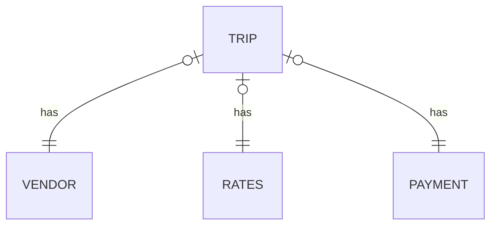

# Занятие 4

## Необходимые инструменты 
- установленная java https://www.oracle.com/java/technologies/javase/jdk11-archive-downloads.html
- PyCharm https://www.jetbrains.com/pycharm/download/

## Данные

Мы будем использовать данные о поездках такси (подробнее см. [описание](../practice1/README.md) первого практического
задания)

Схема данных:

## План занятия

* Создание DataFrame
    * программно
    * из внешнего источника
* Основные операции DataFrame
    * схема
    * JOIN
    * агрегация
    * фильтрация
    * сортировка
* Выгрузка данных
    * в файлы
    * в БД

## Задание для самостоятельной работы:

На основе приведенного кода собрать витрину сгруппированную по неделям:

1. номер недели
2. тип оплаты
3. средний чек
4. отношение чаевых к стоимости поездки
5. (опционально) выгрузить результат в Greenplum
